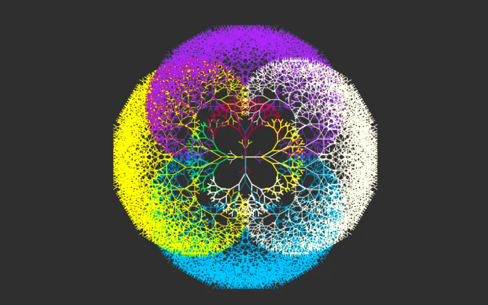

# Turtle Graphics With Python

Originally, the turtle was just a physical object, like a robot that can be placed on a sheet of paper and instructed to move. Then the turtle became a visual display on a high-resolution screen, often depicted as any type of shape.
Even in a purely graphic format, the concept of a turtle can make it easier to represent the actions taken, and therefore what a program does.

The turtle module provides an environment in which turtles move around on a 2-dimensional grid. Turtles have a position, heading `(the direction the turtle is facing)` and a variety of possible states `(turtles can draw lines of a particular colour when they move or leave no trace)` and actions `(turn left or right; move forward or backward)`.

A Turtle object has many methods that can be grouped into families.

### Output

