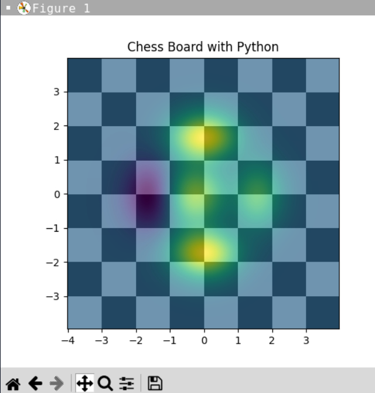

# Chessboard with Python

A chessboard is the type of game board used for the game of chess, on which pawns and chess pieces are placed. A chessboard is usually square, with an alternating pattern of squares of two colours. 
To create a chessboard with the Python programming language, I will use two Python libraries; Matplotlib for visualization, and NumPy for building an algorithm which will help us to create and visualize a chessboard.

### Output

