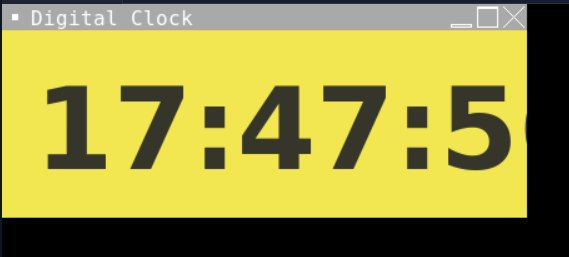

# Digital Clock with Python

The great part of creating your own GUI apps is that you can customize them however you want. From text font to background colour, all features are available for customization. 
In this code, you'll understand how to create a digital clock using python. This is a simple task to get started with the Tkinter library in Python, which is a built-in package that comes with Python. Tkinter has some cool features that can be used to build simple apps.

### Output

