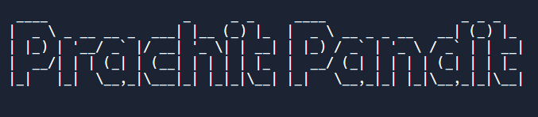

# Create Font Art using Python

The font that appears in the output of your Python program is the default font for your operating system. Changing the font of your output may not be possible without using an external library. This is where the PyFiglet library in Python can come in handy.

The PyFiglet library in Python can be used to visualize the output of your Python program with an amazing font style. If you’ve never used this library before, you can easily install it using the pip command:
```bash
pip install pyfiglet
```

### Output

