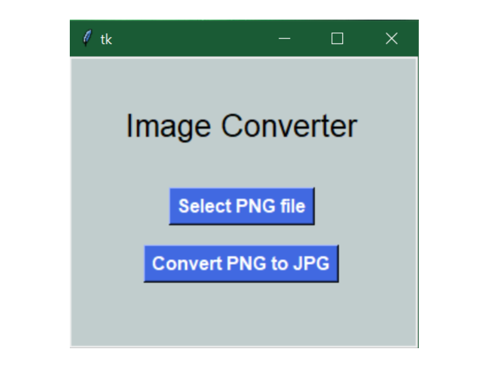

# Image Converter GUI with Python

A large number of image file formats are available for storing graphic data, the most popular being JPG and PNG.<br>
To create an Image converter GUI with Python, I've used the Tkinter library in Python which is the best known Python framework for building GUI application. Other than Tkinter we also need PIL library in Python which stands for Python Imaging Library.<br>

**Installation**

Install the project dependencies:

```bash
pip install pillow
```

If you are using Python 3 and have both Python 2 and Python 3 installed, you might need to use pip3 instead:

```bash
pip3 install pillow
```

<h2>Using conda</h2>

If you are using Anaconda or Miniconda, you can install Pillow using the conda package manager:

```bash
conda install pillow
```

### Output

