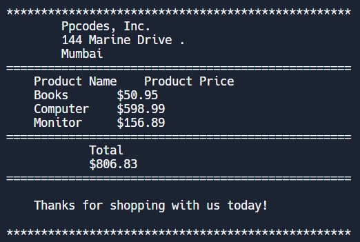

# Create An Invoice With Python

An invoice is a bill that serves as proof of a transaction between a buyer and a seller.
To create an Invoice with Python I will be using the basics of Python programming language. 

It is a beginner level task so it will help you to improve your coding skills. We don’t need to make use of loops here, just print statements and formatting is all we need for this task.

### Output

