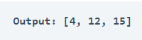

# Finding Out Missing Numbers

Finding the missing number in an array is a popular coding interview question. According to LeetCode, this question is popular in the interviews of companies like Amazon, Adobe, Microsoft, LinkedIn, and many more. 
Finding the missing number in an array means finding the numbers missing from the array according to the range of values inside the array. Most of the time, the question you get based on this problem is like:

- Given an array containing a range of numbers from 0 to n with a missing number, find the missing number in the input array.

To find the missing number in an array, we need to iterate over the input array and store the numbers in another array that we didn’t find in the input array while iterating over it.

### Output

