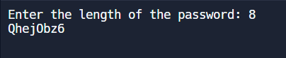

# Python Program to Generate Password

To create a password with Python, we need to create a program that takes the length of the password and generates a random password of the same length. 
To write a Python program to create a password, declare a string of numbers + uppercase + lowercase + special characters. Take a random sample of the string of a length given by the user. 
In this code, I've first imported the random module in Python, then I asked for user input for the length of the password. Then I stored the letters, numbers and special characters that I want to be considered while generating a password. Then I am doing a random sampling by joining the length of the password and the variable s, which will finally generate a random password.

### Output

