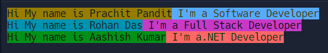

# Print Colored Text with Python

Traditionally, printing full-colour text to the terminal is accomplished by a series of escape characters on Linux or OS X systems. However, this will not work for Windows operating systems. 
In Python the Colorama module allows us to easily create colored terminal text. 

## What is Colorama in Python?

Using the Colorama module we can print colored text with Python. We can use it and call its built-in variables which are aliases for the desired ANSI codes. This makes our code more readable and works better with Windows command prompts after calling `colorama.init()` at the start of your script. 
The Colorama module offers three main formatting options: Fore, Back, and Style. These allow us to change the foreground or background text color and style. The colors available for the foreground and background are black, red, green, yellow, blue, magenta, cyan, and white.

### Output

