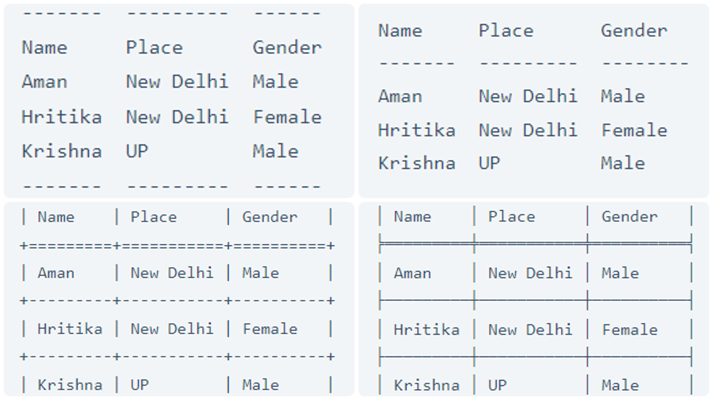

# Create Tables With Python

Python is a very easy and versatile programming language. It offers libraries and modules for almost every task that you can think about. While working with data using python sometimes it becomes difficult to present it in a tabular format by using the standard formatting functions provided by Python.
The tabulate module in Python allows us to create and display data in a tabular format which makes the data look more readable. It can be used to organize your data to make it more understandable. Below are some of the data structures in Python which are supported by the tabulate module:

- Lists
- Dictionary
- NumPy Array
- Pandas DataFrame

The tabulate module doesn’t come preinstalled in the Python standard library so you can easily install it by using the pip command: 
```bash
pip install tabulate
```

### Output

